# RO System Design and Performance Projection Software (Demo)

> A desktop application for reverse osmosis (RO) system design, feedwater setup, performance projection, flow-diagram visualization, and report export.

## Demo Download

The Windows demo package is available via Google Drive:

[Download Demo Package (Google Drive)](https://drive.google.com/drive/folders/1EpuGKqUIPPo4n_fWoPXMP_iP6EYZvBTp)

## Overview

This repository presents a **portfolio demo** of an RO system design software package developed for industrial water-treatment applications. The software allows users to define feedwater quality, configure an RO system, project operating performance, inspect stage-level results, and export structured reports.

The demo is intended to showcase the **product workflow, software interface, and reporting capability** of the project.

> **Important note**
> - This repository is for **demonstration and documentation** purposes.
> - The software registration / copyright holder shown in the certificate section is **江苏新宜中澳环境技术有限公司**.
> - Proprietary source code, internal business logic, and commercial deployment details are **not fully disclosed** in this public demo.

---

## Key Features

- **Feedwater setup**
  - Enter water quality information such as ion concentrations, pH, temperature, TDS/EC, turbidity, SDI, and TOC.
- **RO system design**
  - Configure system type, stage/section layout, membrane model, pressure vessels, element count, target product flow, and recovery.
- **Automatic design mode**
  - Generate a feasible design automatically for supported cases.
- **Flow-diagram visualization**
  - Inspect the configured RO schematic directly in the UI.
- **Performance projection**
  - Review system-level, stage-level, and detailed design outputs.
- **Report export**
  - Export reports to **PDF**, **Excel**, and **Word**.
- **Project management**
  - Save and re-open projects for later revision.

---

<!-- ## Demo Screenshots

### Main design page
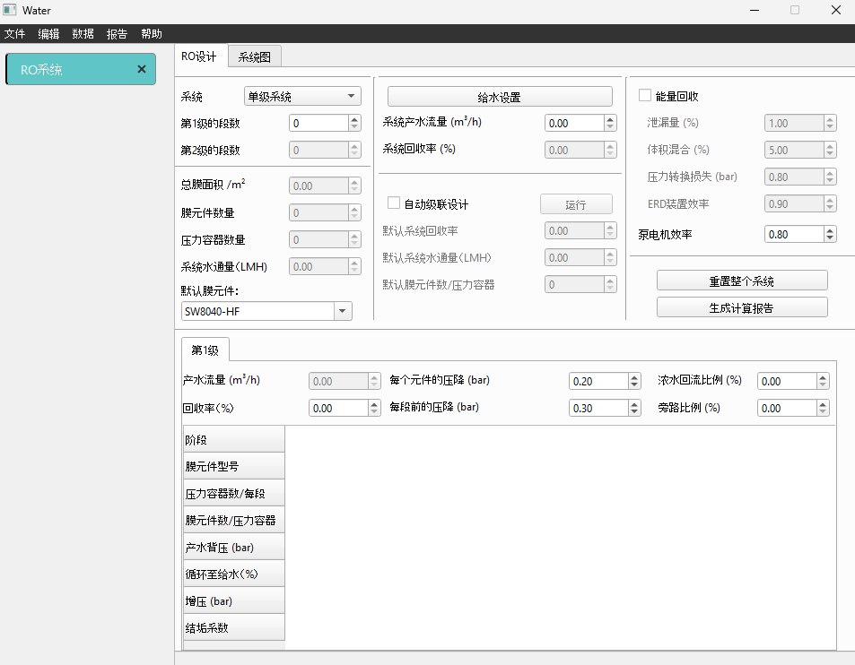

### Feedwater settings
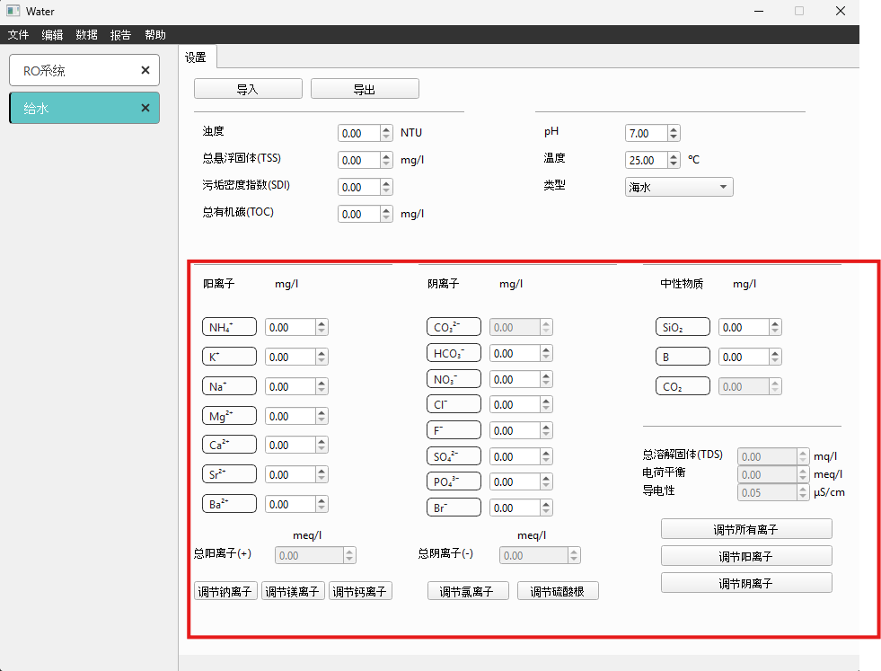

### System flow diagram
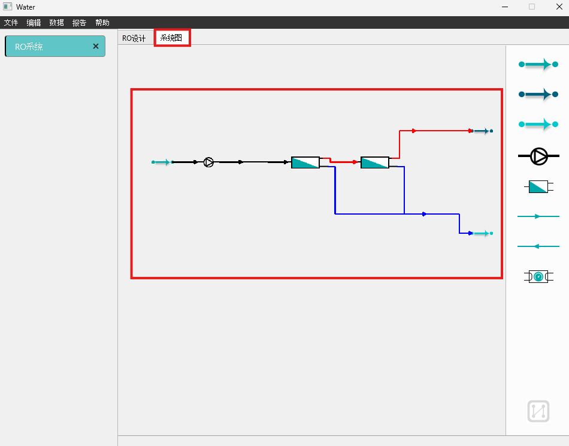

### Performance report view
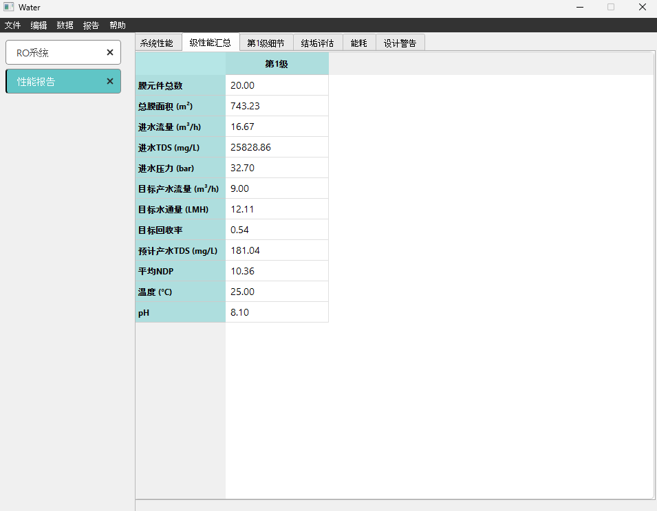

--- -->

## Installation (Windows)

### System requirements

- **Operating system:** Windows 11 (64-bit)
- **Processor:** Intel Core i5 (8th Gen) or equivalent
- **Memory:** 4 GB RAM or above
- **Storage:** At least 10 GB free space

### Installation steps

1. Download the compressed package and move it to the desktop.

  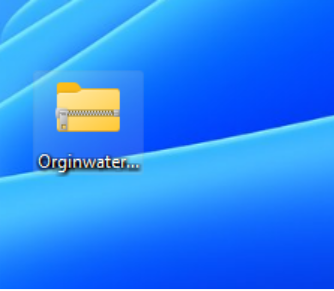

2. Extract the compressed package.

  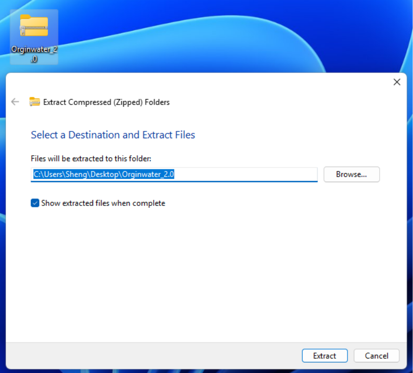

3. Open the extracted folder and run the executable.

  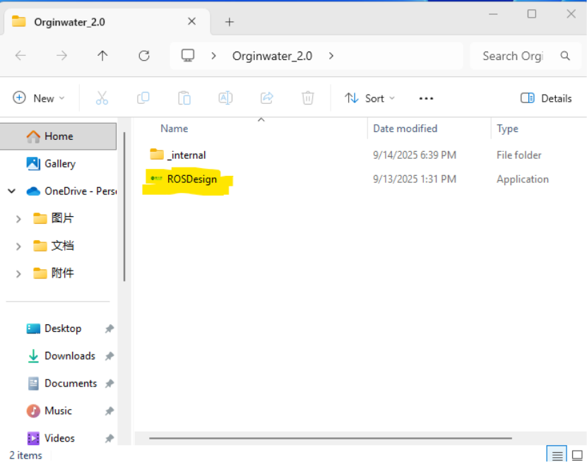

> If Windows shows a security prompt, proceed only if you trust the source of the package.

---

## Usage Workflow

### Step 1. Create a new project
Open **文件 → 新项目** to initialize a new RO design project.

<p float="left">
  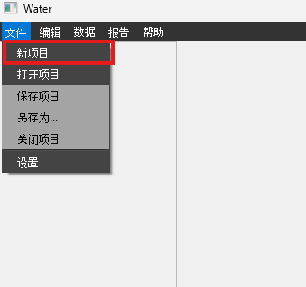
  
</p>

### Step 2. Enter feedwater information
Click **给水设置** to enter feedwater information, including major ions, pH, temperature, and other water-quality indicators.

<p float="left">
  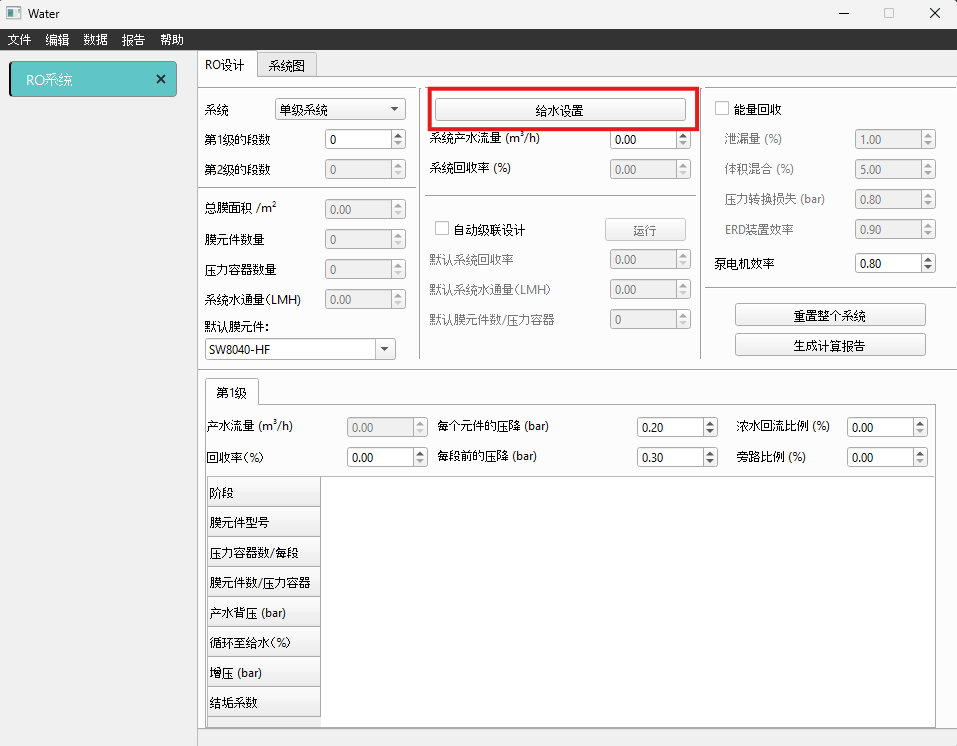
</p>


### Step 3. Configure the RO system
Return to the main page and define the system design, including:

- system type
- number of sections / stages
- product water flow
- recovery target
- membrane model
- pressure-vessel arrangement
- elements per vessel
- optional recycle / bypass / pressure settings

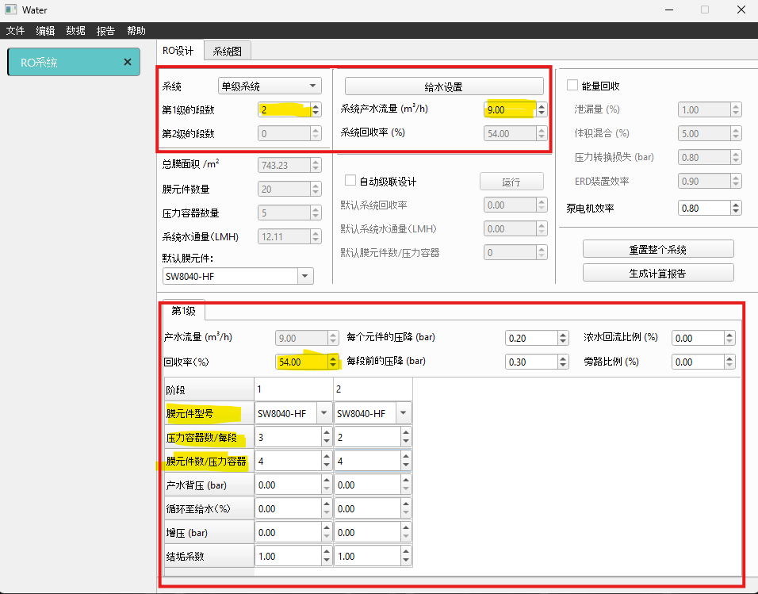

After configuration, switch to **系统图** to inspect the generated flow diagram.


### Step 4. Run the calculation
Click the calculation button to project RO performance.

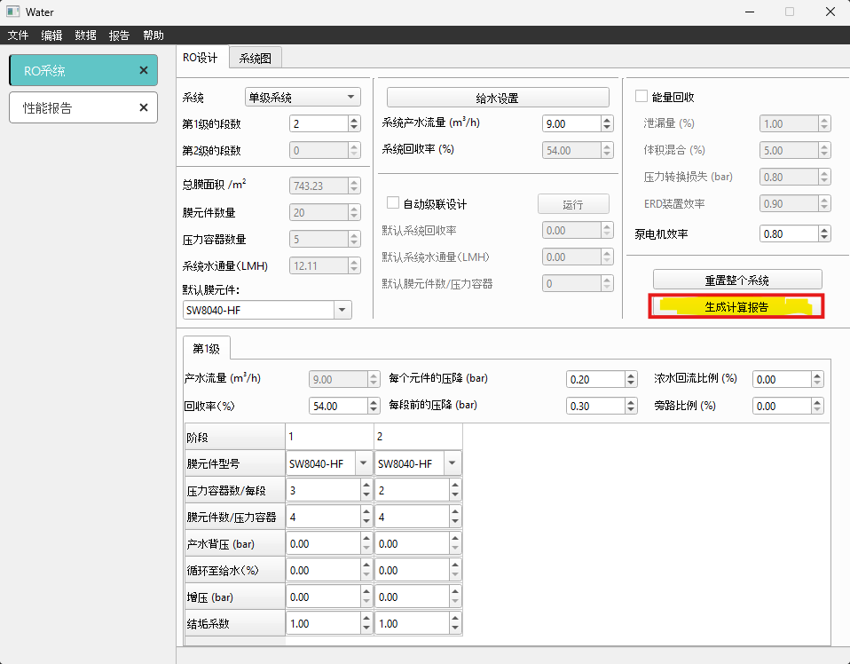

### Step 5. Review the results
Inspect the generated performance report, including system summary, stage summary, design details, scaling-related indicators, and energy-related outputs.


### Step 6. Export the report
The report can be exported in multiple formats, including **PDF**, **Excel**, and **Word**.

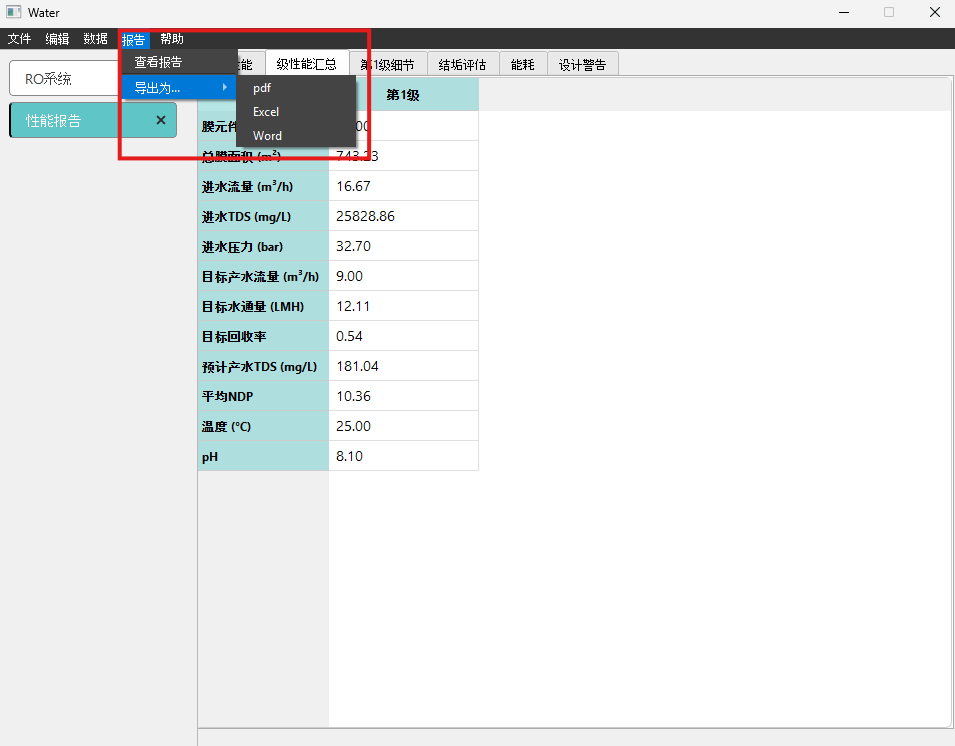

---

## Additional Functions

### Automated system design
When automatic design is enabled, the user only needs to provide a limited set of high-level design inputs, such as:

- target product water flow
- default recovery
- default water flux
- default number of elements per pressure vessel

The software then generates a feasible design automatically for supported scenarios.

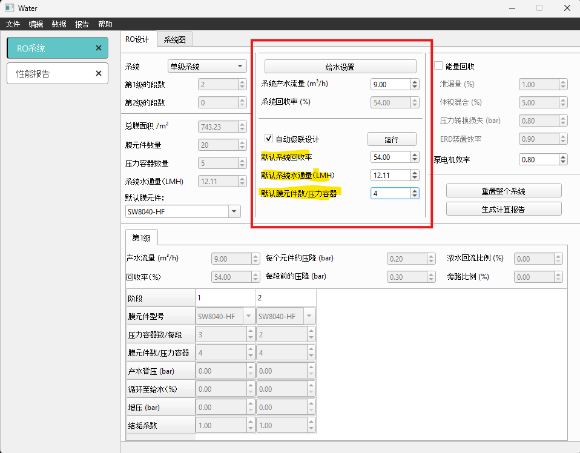

### Save and load projects
Projects can be saved and loaded for later editing.

<p float="left">
  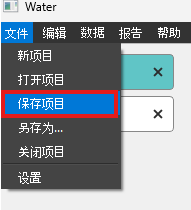
  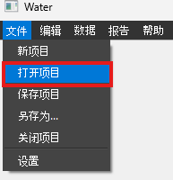
</p>

---

## Patent / Software Registration

The software has been formally registered in China.

- **Software name:** 反渗透水站性能映射软件 V1.0
- **Registration number:** 2026SR0511888
- **Copyright holder:** 江苏新宜中澳环境技术有限公司
- **Registration date:** 2026-03-31


---

<!-- ## Suggested Repository Structure

```text
.
├── README.md
└── docs
    └── images
        ├── install1.png
        ├── install2.png
        ├── install3.png
        ├── step1_mainpage.png
        ├── step1_newproj.png
        ├── step2_enterwaterinfo.png
        ├── step2_feedwaterbutton.png
        ├── step3_flowdiagram.png
        ├── step3_sysdesign.png
        ├── step4_calbutton.png
        ├── step5_viewreport.png
        ├── step6_exportreport.png
        ├── other_autodesign.png
        ├── other_openproj.png
        ├── other_saveproj.png
        └── China Software Patent.png
```

--- -->

## Disclaimer

This repository is a **public-facing demo** of a previously developed software product. It is intended to demonstrate:

- software scope
- UI workflow
- project background
- reporting and export capability

It is **not** intended to fully reproduce the original commercial software or disclose proprietary implementation details.

<!-- 
## Contact / Notes

If you are using this repository as part of a portfolio or technical showcase, you may further add:

- a short project background section
- implementation stack (for example: Python, PySide6/Qt, JSON-based project files, report generation pipeline)
- your own contribution statement
- a demo video or release package link -->

